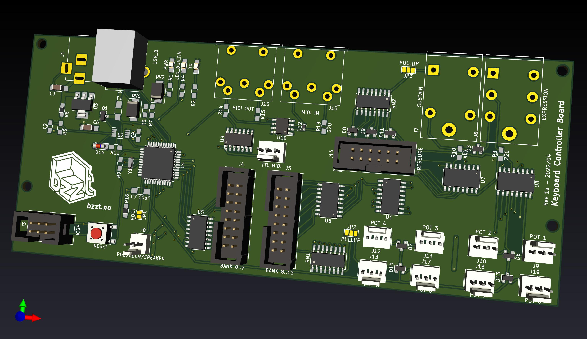

# MidiKeys

Dissecting an old broken organ I got the idea to turn it into a MIDI keyboard.

I've since gotten a keybed that already had dual key switches for the velocity sensitivity, and been working on circuitry and code to support velocity sensitivity.

My plan is to produce a versatile open source keyboard controller board that can be used in various keyboard projects.

Works:

* Velocity sensitive multiplexed keyboard scanning
* Note off velocity sensitivity (not common in commercial keyboards, fun to be had here)

Plans:

* Work out the bugs in the keyboard scanner (keys sometimes hang or go undetected)
* Pot/slider (analog input) multiplexing
* Dedicated PCB with all required components and connectors
* Aftertouch support (channel pressure)
  * Maybe pseudo-polyphonic aftertouch is possible using a handful of pressure sensors (one per octave?) and interpolating the key pressure. Not sure about this.

Maybe in time:

* Mackie style DAW control support
* Keyboard splits and layers
* Interactive configuration from computer
* Arpeggiator with some cool touches?
  * Internal or MIDI timing
  * Oneshot/lick mode: Only arpeggiate when multiple keys are on, and in play order. Lay a chord and let the keyboard "slide" through the notes for you. In tempo.
